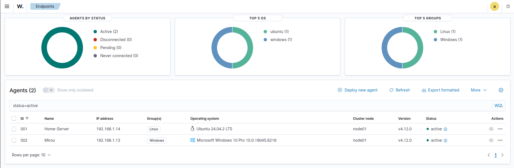
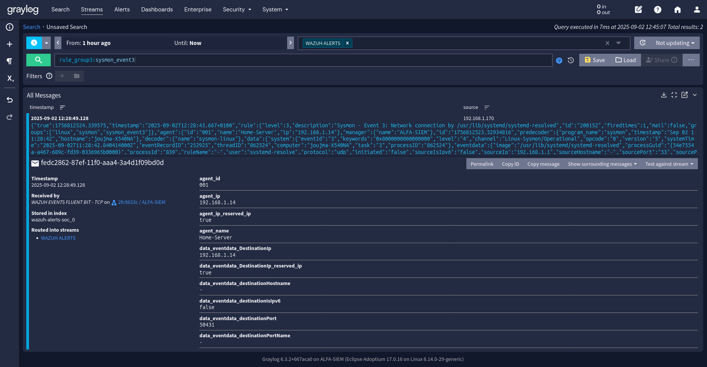

# SOC-SIEM (Automated Open-Source SOC/SIEM Stack)

A fully automated, production-style open-source SIEM stack using Wazuh, Graylog, OpenSearch, Fluent Bit, and Grafana. Everything is Infrastructure-as-Code with a single orchestrator.


## Stack overview


- Wazuh Manager, Dashboard, and Indexer (OpenSearch)
- Graylog + MongoDB
- Fluent Bit shipper (Wazuh alerts -> Graylog)
- Grafana (TLS-only) with OpenSearch datasource and dashboards

## Quick start
1) Prereqs: Ubuntu/Debian or RHEL/CentOS, sudo, Internet access, DNS for hosts.
2) Edit `.env` at repo root and set required variables (IPs, hostnames, passwords).
3) Required: generate certs bundle
    - `bash commponents/config/generate_certs.sh`
4) Install all components
    - `bash ./install.sh`

Service URLs (defaults)
- Wazuh Dashboard: https://<WAZUH_DASHBOARD_IP>:443
- Graylog: http://<GRAYLOG_SERVER_IP>:9000
- Grafana: https://<GRAFANA_DASHBOARD_HOSTNAME>:3000

## Component docs
- Grafana: commponents/grafana/README.md
- Graylog: commponents/graylog/README.md
- Wazuh Indexer: commponents/wauzh/wazuh-indexer/README.md
- Wazuh Dashboard: commponents/wauzh/wazuh-dashboard/README.md
- Wazuh Manager: commponents/wauzh/wazuh-manager/README.md
- Fluent Bit: commponents/fluent-bit/README.md
- Certs/Config: commponents/config/README.md

## Project structure
```
commponents/
  grafana/           # Installer, TLS config, provisioning
  graylog/           # Installer, server.conf, content_packs/
  fluent-bit/        # Installer + fluent-bit.conf template
  wauzh/
     wazuh-indexer/   # OpenSearch installer, security init
     wazuh-dashboard/ # TLS config + dashboards config
     wazuh-manager/   # Manager config (ossec.conf, agent shared configs)
architecture/        # Diagrams (PNG)
dashboards/          # Screenshots and JSON
rules/               # local_rules.xml and SOCFortress runner
docs/                # Extra docs
install.sh           # Orchestrated end-to-end installer
.env                 # Central configuration (not committed)
```

## Highlights
- Orchestrated install with `install.sh` (certs -> indexer -> dashboard -> manager -> graylog -> fluent-bit -> grafana)
- Configuration templating via envsubst; single `.env` as source of truth
- TLS by default for Grafana; shared cert bundle for all components
- OpenSearch security: role/user/mapping for Grafana (user `grafna`)
- Optional Graylog content pack installation

## Screenshots

Architecture


Dashboards





## Troubleshooting
- Check services: `systemctl status <service>` (wazuh-indexer, wazuh-manager, wazuh-dashboard, graylog-server, grafana-server, fluent-bit)
- Logs: `journalctl -u <service> -n 200 --no-pager`
- Certificates: ensure `commponents/config/wazuh-certificates.tar` exists and contains host certs (e.g., `<host>.pem` and `<host>-key.pem`)

## Notes
- The repo intentionally uses a central `.env` for all installers. Keep it private.
- Component-specific requirements and variables are documented in each subfolder README.
